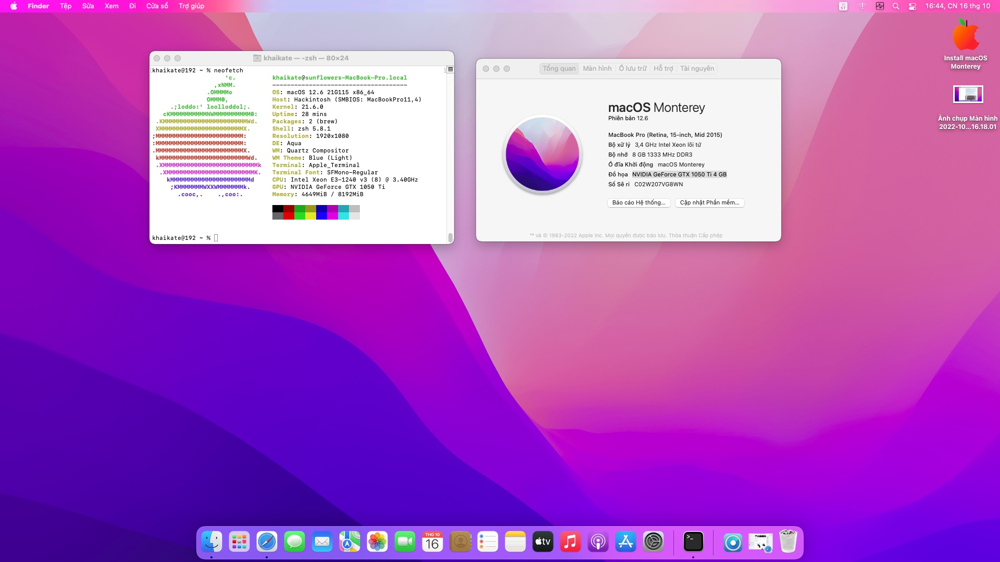
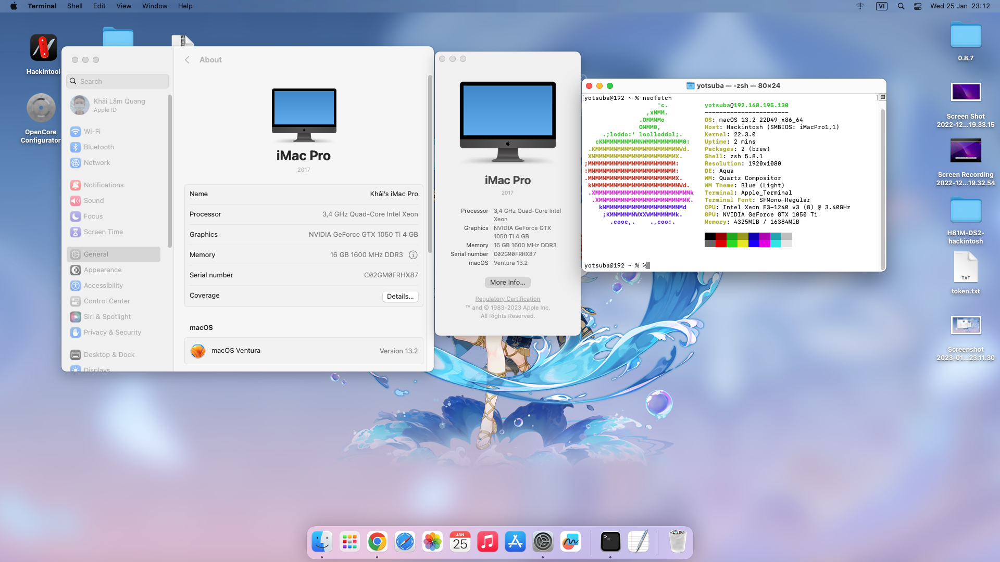

# H81M-DS2-hackintosh

## PC specification

| Part  | Info |
| ------------- | ------------- |
| Mainboard | Gigabyte H81M-DS2 |
| CPU:  | Intel Xeon E3-1240 v3 (Haswell, 3,40 GHZ up to 3.80 GHz, 4 core 8 thread)  |
| RAM:  | 16GB (DDR3)  |
| GPU:  | NVIDIA Geforce GTX 1050TI (GP107, 128bit, 4GB GDDR5) |
| Network: | Realtek RTL8111 |
| Sound:  | Realtek ALC887 (best layout-id in my build is 3)  |
| SMBIOS:  | iMacPro1,1  |

## Software

- macOS Monterey 12
- macOS Ventura 13
- OpenCore 0.9.3

## Compatible with
- Windows 10
- macOS Monterey 12
- macOS Ventura 13
- Linux

## KEXT
- AppleALC : 1.8.3
- Lilu : 1.6.6
- RealtekRTL8111 : 2.4.2
- USBInjectAll: 0.8.0
- VirtualSMC : 1.3.2
- WhateverGreen : 1.6.5

## What is working

- [x] Microphone (pink 3.5mm input)
- [x] Speaker (green 3.5mm input)
- [x] Services (App Store, Apple Music,...)
- [x] Graphics card
- [x] USB 2.0/3.0
- [x] Bootcamp
- [x] HoRNDIS
- [ ] You tell me.

## How to install graphic card
- macOS Monterey, Ventura : OpenCore Legacy Patcher 0.6.x

## Screenshot

 

 
